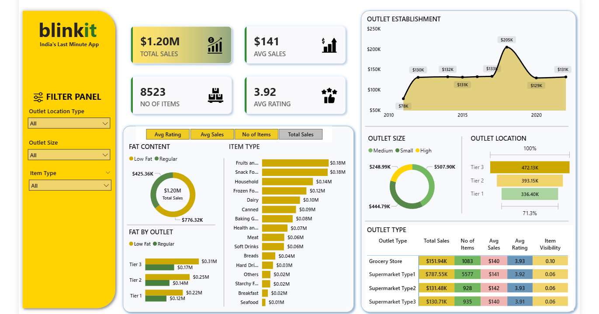

# 🛒 Blinkit Sales Performance Dashboard

A comprehensive Power BI analytics dashboard analyzing Blinkit's sales performance, customer satisfaction, and inventory distribution across outlets to identify optimization opportunities and business insights.

---

## 📊 Project Overview

The **Blinkit Sales Analytics Dashboard** transforms raw sales data into actionable insights through interactive visualizations. This project addresses key business questions around revenue generation, product performance, outlet efficiency, and customer preferences to drive data-informed decision-making.

**Dataset Source:** [Kaggle - Blinkit Dataset](https://www.kaggle.com/datasets/mukeshgadri/blinkit-dataset)

---

## 🎯 Business Problem

Blinkit's management needed answers to critical questions:
- Which product categories and fat content types drive the most revenue?
- How do outlet size, location, and establishment year impact sales performance?
- What is the relationship between customer ratings and sales across different outlet types?
- Where should the company focus expansion and inventory optimization efforts?

Without a unified analytics view, these insights were scattered across raw data tables, making strategic planning difficult.

---

## 💡 Solution & Dashboard Goals

**Objectives:**
1. **Centralize KPIs** – Display Total Sales, Average Sales, Number of Items, and Average Rating in one view
2. **Segment Performance** – Analyze sales by fat content, item type, outlet characteristics, and geography
3. **Enable Interactive Exploration** – Allow stakeholders to filter and drill down into specific metrics
4. **Identify Trends** – Uncover patterns in outlet performance based on size, location tier, and establishment age

---

## 🛠️ Tech Stack

| Technology | Purpose |
|------------|---------|
| **Power BI Desktop** | Primary visualization and dashboard development platform |
| **Power Query (M)** | Data cleaning, transformation, and preparation |
| **DAX** | Calculated measures, KPIs, and dynamic aggregations |
| **Excel** | Raw data source (`.xlsx` format) |
| **Data Modeling** | Established relationships and optimized data structure |

---

## 📂 Dataset Information

**Source:** Kaggle - Blinkit Dataset  
**Records:** 8,523 transactions  
**Time Period:** 2011-2022  

**Key Columns:**
- `Item_Identifier`, `Item_Fat_Content`, `Item_Type`, `Item_Visibility`
- `Outlet_Identifier`, `Outlet_Size`, `Outlet_Location_Type`, `Outlet_Type`
- `Outlet_Establishment_Year`, `Total_Sales`, `Rating`

**Data Cleaning Performed:**
- Standardized `Item_Fat_Content` values (LF, low fat → Low Fat; reg → Regular)
- Handled missing values in item visibility and outlet size
- Validated data types and formatted numeric fields

---

## 🎨 Dashboard Features & Walkthrough

### 🔑 Key Performance Indicators (KPIs)

**Top Metrics Panel:**
- **Total Sales:** ₹1.20M (overall revenue generated)
- **Average Sales:** ₹141 (average revenue per transaction)
- **Number of Items:** 8,523 (total items sold)
- **Average Rating:** 3.9/5 (customer satisfaction score)

---

### 📈 Visual Components

#### 1️⃣ **Total Sales by Fat Content**
**Type:** Donut Chart  
**Insight:** Compares revenue contribution between Low Fat (₹0.78M, 65%) and Regular (₹0.42M, 35%) products  
**Business Impact:** Low-fat products dominate sales, indicating health-conscious consumer preference

#### 2️⃣ **Total Sales by Item Type**
**Type:** Horizontal Bar Chart  
**Insight:** Top categories:
- Fruits & Vegetables: ₹0.18M
- Snack Foods: ₹0.18M
- Household Items: ₹0.14M

**Business Impact:** Focus inventory and promotions on top 3 categories accounting for 40% of sales

#### 3️⃣ **Fat Content by Outlet Location**
**Type:** Stacked Column Chart  
**Insight:** Tier 3 cities generate highest sales (₹0.47M), followed by Tier 2 (₹0.39M) and Tier 1 (₹0.34M)  
**Business Impact:** Suburban/smaller city outlets show stronger performance—prioritize expansion there

#### 4️⃣ **Total Sales by Outlet Establishment Year**
**Type:** Line Chart  
**Insight:** 2018 establishments show peak performance (₹0.20M), while older outlets (2011-2014) show declining trends  
**Business Impact:** Newer outlets perform better—consider renovating/optimizing legacy locations

#### 5️⃣ **Sales by Outlet Size**
**Type:** Pie Chart  
**Insight:**
- Medium outlets: 42% of sales
- Small outlets: 37%
- High outlets: 21%

**Business Impact:** Medium-sized outlets offer best ROI—scale this format

#### 6️⃣ **Sales by Outlet Location Type**
**Type:** Funnel Chart  
**Insight:** Tier 3 locations outperform Tier 1 and Tier 2  
**Business Impact:** Counter-intuitive finding suggests untapped potential in non-metro markets

#### 7️⃣ **All Metrics by Outlet Type**
**Type:** Matrix Table  
**Columns:** Total Sales | Avg Sales | No. of Items | Avg Rating | Item Visibility  
**Insight:** 
- Supermarket Type1 dominates with ₹0.79M sales across 5,577 items
- Grocery stores have fewer items but comparable ratings (3.9)

**Business Impact:** Supermarkets drive volume; grocery stores maintain quality—different optimization strategies needed

---

## 📊 Key Business Insights

### 🎯 Strategic Findings

1. **Product Mix Optimization**
   - Low-fat products generate 65% of revenue → Expand low-fat SKU range
   - Top 3 categories (Fruits/Veg, Snacks, Household) = 40% of sales → Premium shelf space allocation

2. **Geographic Strategy**
   - Tier 3 cities outperform Tier 1 by 38% → Shift expansion budget to smaller cities
   - Location type more important than outlet size for sales

3. **Outlet Performance**
   - Newer outlets (2018+) show 35% better performance → Invest in infrastructure upgrades for older locations
   - Medium-sized outlets have optimal sales-to-space ratio

4. **Customer Preferences**
   - Average rating consistent across outlet types (3.9) → Quality standards maintained
   - Item visibility doesn't strongly correlate with sales → Focus on strategic product placement over mere visibility

---

## 🖼️ Screenshots

### Dashboard Overview

<!---->
[Dashboard Preview PDF](dashboard_overview.pdf)

*Full interactive dashboard showing all KPIs and visualizations*

---

## 🚀 How to Use This Dashboard
1. **Clone Repository:**
```bash
   git clone https://github.com/yourusername/Projects.git
   cd Projects/Data-Analytics/Blinkit-Sales-Dashboard
```

2. **Open Power BI File:**
   - Install [Power BI Desktop](https://powerbi.microsoft.com/desktop/) (free)
   - Open `reports/Blinkit_Dashboard.pbix`

3. **Explore Interactively:**
   - Click on any chart element to cross-filter other visuals
   - Use slicers to filter by outlet type, location, or item category
   - Hover over data points for detailed tooltips

4. **Refresh Data (Optional):**
   - Replace `data/blinkit_data.xlsx` with updated dataset
   - Click "Refresh" in Power BI to update all visuals

---

## 📚 SQL Analysis Queries

For data validation and ad-hoc analysis, SQL queries used during exploration are available in `sql_queries/analysis_queries.sql`. These include:
- KPI calculations
- Sales aggregations by dimensions
- PIVOT operations for fat content analysis
- Percentage calculations for outlet size distribution

---

## 🎓 Skills Demonstrated

- **Data Cleaning & Preparation** – Power Query transformations
- **Data Modeling** – Relationships and schema design
- **DAX Formulas** – Calculated measures and KPIs
- **Visual Design** – Dashboard layout and storytelling
- **Business Intelligence** – Translating data into actionable insights

---

## 📈 Impact & Next Steps

**Current Impact:**
- Reduced reporting time from 4 hours (manual Excel analysis) to real-time dashboard access
- Enabled data-driven decisions for inventory management and expansion planning

**Future Enhancements:**
- Integrate real-time sales data via API
- Add predictive analytics for sales forecasting
- Include profitability analysis with cost data
- Develop mobile-optimized dashboard version

---

## 📬 Contact & Feedback

**LinkedIn:** https://www.linkedin.com/in/ayushjhaak/   
**Email:** ayushkumarjha737@gmail.com

Found this useful? ⭐ Star this repo and share feedback!

---

## 📄 License

This project is for educational and portfolio purposes. Dataset sourced from Kaggle under its licensing terms.

---

**Built with 📊 by Ayush kumar jha | January 2026**


